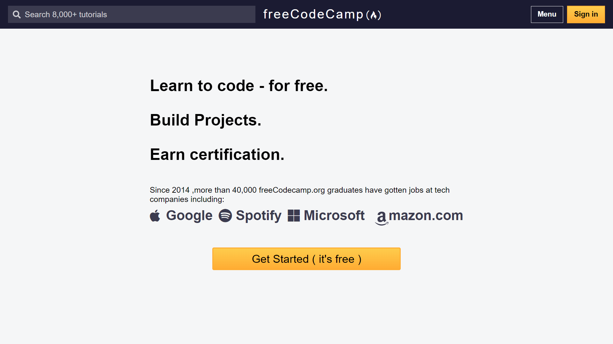
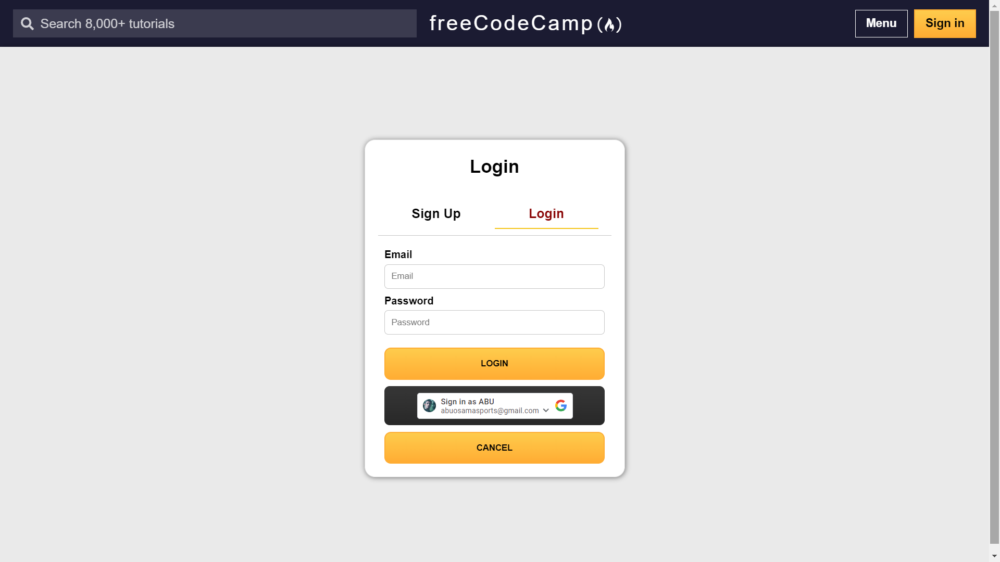
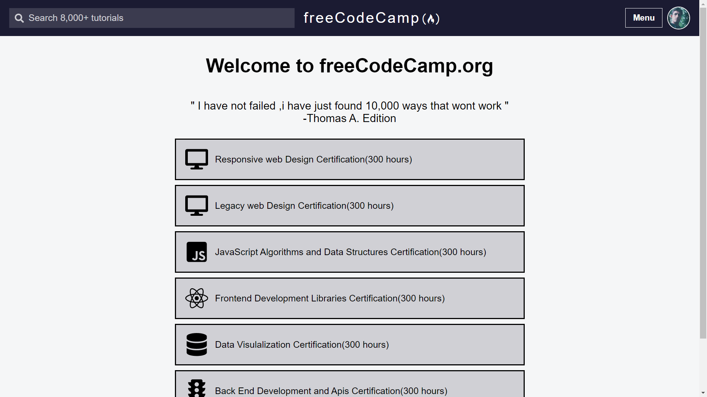

# talentbox_Assignment

Welcome to the talentbox course assignment Application! This web application allows you to browse different courses

## Table of Contents

- [About](#about)
- [Features](#features)
- [Getting Started](#getting-started)
- [Usage](#usage)
- [Technologies Used](#technologies-used)
- [Deployment](#deployment)
- [Contributing](#contributing)
- [License](#license)

## About

talentbox course is a web application designed to help you to explore courses
## Features

- Browse a collection of course.
- see the collection of course with duration
- user authentication and google login functionality.

## Screenshots

## Deployment

Deployed Link:-https://talentbox-assignment.vercel.app

## Getting Started

# Clone the repository

git clone https://github.com/Abu1Osama/talentbox_Assignment.git

# Change directory

cd your-repo

# Install dependencies

npm install

# Start the development server

npm start

## Technologies Used

- talentbox course  is built using the following technologies:

- React.js
- css
- Axios
- node-js
- Express-js
- mongoDb
- Render
- vercel

## Usage

- Visit the application in your web browser at http://localhost:3000 or the URL https://talentbox-assignment.vercel.app/.
- Browse a collection of course.
- see the collection ofcourse with duration
- Google login and login with email functionality.

